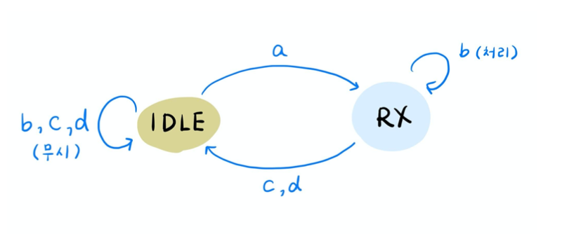

## Protocol Design
> Final project as an assignment of 'Network Protocol Design (Capstone)' class.  
> Implemented protocol 'Push-to-Chat' with C and Lora board.    
    
    
  ---  
      
      
## :pushpin: FSM (Finite-State Machine) Design  
  
  ### Client FSM  
    
  - State  
    - IDLE : 중재자로부터 발언권을 받지 못한 상태  
    - VR (Voice Request) : 중재자에게 발언권을 요청한 상태  
    - Voice : 중재자로부터 발언권을 얻은 상태  
      
  - Event  
    A) VR SDU in  
    B) Allow PDU  
    C) Denied PDU  
    D) Text SDU in  
    E) VD (Voice Done) SDU in  
    F) Data PDU in  
    G) Timer expired PDU in  
      
    
      
  ### Arbitrator FSM  
    
  - State  
    - IDLE : 모든 Client가 발언권이 없는 상태  
    - TX : Client로 송신하는 상태  
    - RX : Voice Client가 있는 상태  
      
  - Event  
    A) VR PDU in  
    B) Text PDU in  
    C) VD (Voice Done) PDU in  
    D) Timer expire  
    
    . 
    
    
  
