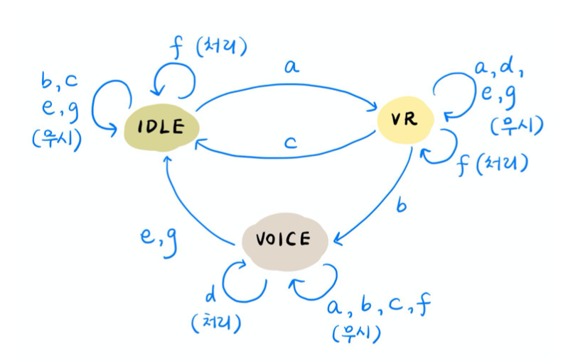

## Protocol Design  
### 여혜민 (IT공학/팀장), 김주영 (IT공학/팀원), 김수빈 (전자공학/팀원)
> '네트워크 프로토콜 설계 (캡스톤)' 수업 최종 과제  
> C와 로라보드를 활용하여 직접 'Push-to-Chat' 프로토콜 설계 및 구현     
> FSM 설계 -> 제공된 베이스라인 코드 기반으로 팀 단위로 구현   
> <a href="https://github.com/skmwit/ProtocolDesign/blob/main/img/result_.mp4">결과 영상</a>  
    
  ---  
      
      
## :pushpin: FSM (Finite-State Machine) Design  
  
  ### Client FSM  
    
  - State  
    - IDLE : 중재자로부터 발언권을 받지 못한 상태  
    - VR (Voice Request) : 중재자에게 발언권을 요청한 상태  
    - Voice : 중재자로부터 발언권을 얻은 상태  
      
  - Event  
    A) VR SDU in  
    B) Allow PDU  
    C) Denied PDU  
    D) Text SDU in  
    E) VD (Voice Done) SDU in  
    F) Data PDU in  
    G) Timer expired PDU in  
      
    
      
  ### Arbitrator FSM  
    
  - State  
    - IDLE : 모든 Client가 발언권이 없는 상태  
    - TX : Client로 송신하는 상태  
    - RX : Voice Client가 있는 상태  
      
  - Event  
    A) VR PDU in  
    B) Text PDU in  
    C) VD (Voice Done) PDU in  
    D) Timer expire  
    
    . 
    
    
  
